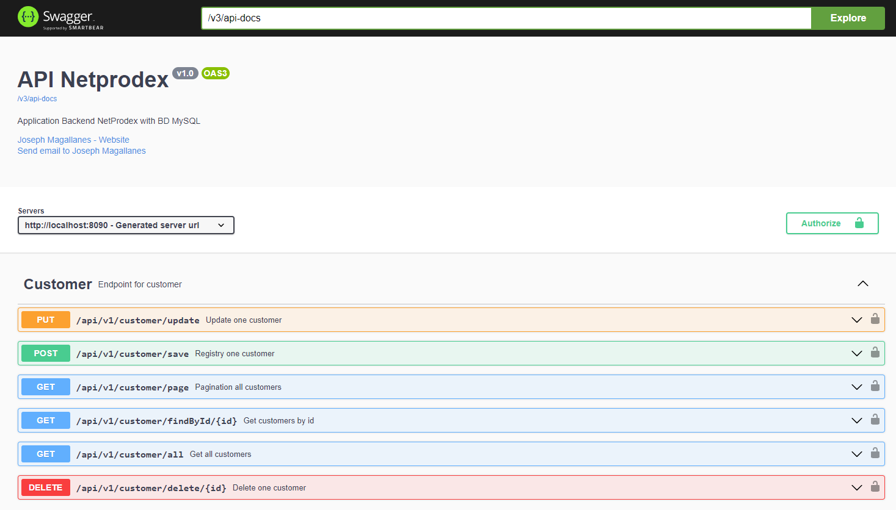
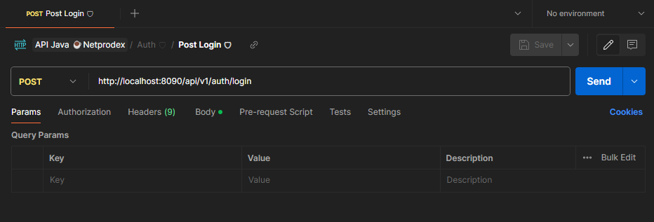
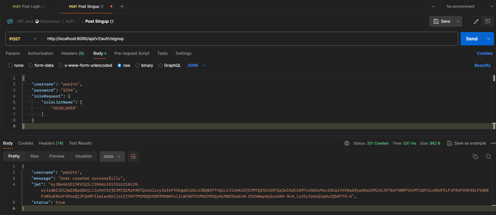
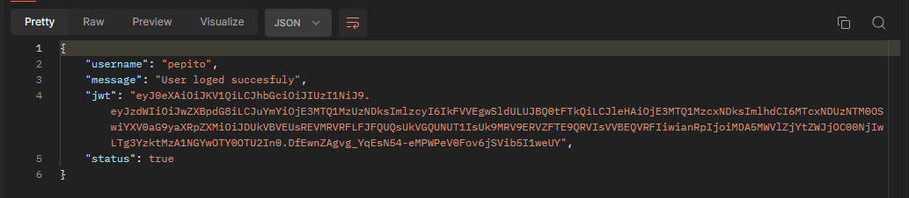
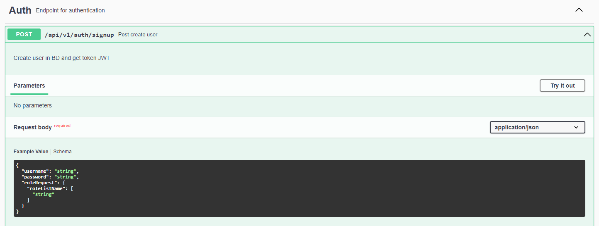
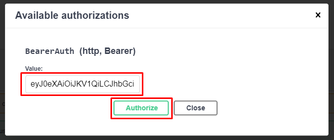
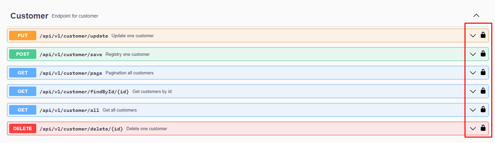

[](https://adoptium.net/es/temurin/releases/?os=windows&arch=any&package=jdk&version=17)

[](https://mvnrepository.com/artifact/org.springframework.boot/spring-boot-starter-data-jpa/3.2.5)
[](https://mvnrepository.com/artifact/org.springframework.boot/spring-boot-starter-web/3.2.5)
[](https://mvnrepository.com/artifact/org.springdoc/springdoc-openapi-starter-webmvc-ui/2.1.0)

[](https://mvnrepository.com/artifact/org.springframework.boot/spring-boot-starter-security/3.2.5)
[](https://mvnrepository.com/artifact/org.mapstruct/mapstruct/1.5.5.Final)
[](https://mvnrepository.com/artifact/com.mysql/mysql-connector-j/8.3.0)
[](https://mvnrepository.com/artifact/org.projectlombok/lombok/1.18.32)
[](https://mvnrepository.com/artifact/org.hibernate.orm/hibernate-core/6.4.4.Final)


# API NETPRODEX (v1.0)

Api creado para registro de clientes para BD MySQL, CRUD JPA, documentación Springdoc y JWT.

## Instalación

1. Abrir con su ID preferido e instalar las dependencias.
2. Al ejecutar el proyecto, ingresar a un navegador a la siguiente ruta:
   ```
   http://localhost:8090/swagger-ui/index.html
   ```

    - La manipulación de los datos se puede realizar por el mismo Swagger:
      

    - Tambíen se puede realizar por Postman o SoapUI.
      

3. Primero se debe crear un usuario, para poder asi desbloquear los métodos CRUD de Customer:

   

   **Ejemplo de código para crear un nuevo usuario**
    ```
    URL: http://localhost:8090/api/v1/auth/signup
   
    {
       "username": "pepito",
       "password": "1234",
       "roleRequest": {
          "roleListName": [
              "DEVELOPER"
          ]
       }
    }
    ```
4. Luego ingresar con el Token JWT del resultado, en Authorization (Bearer Token), luego pegar el token en el input 
   (**solo el token**):

    

    - Para el caso de Swagger Web, generar el token por el método (**/api/v1/auth/singup**), y Execute:
      
    - Cuando devuelva el token, copiarlo para luego pegarlo (botón -> Authorize), y luego en Authorize:
      
    - Luego de ingresar el token los candados estarán listos para usar los métodos de Customer:
      
    - Recordar que los permisos roles registrados son los siguiente:
      ````
      - ADMIN
      - USER
      - INVITED
      - DEVELOPER
      ````
    - Para mayor detalle, revisar el ApiNetprodexApplication.java de inicio del proyecto, ahi se encuentra la query de los roles y permisos.

## Uso

### Auth (the auth API)
- Json signup user:
    ````
    *** METHOD: POST ***
    URL: http://localhost:8090/api/v1/auth/signup
    ````
    ````
    {
       "username": "francisco",
       "password": "123456",
       "roleRequest": {
          "roleListName": [
              "ADMIN"
          ]
       }
    }
    ````
- Json login user
    ````
    *** METHOD: POST ***
    URL: http://localhost:8090/api/v1/auth/login
    ````
    ````
    {
       "username": "francisco",
       "password": "123456"
    }
    ````
### Customer (the customer API)
- **Get customer all:**
    ````
    *** METHOD: GET ***
    URL: http://localhost:8090/api/v1/customer/all
    ````
- **Get customer page:**
    ````
    *** METHOD: GET ***
    URL: http://localhost:8090/api/v1/customer/page
    ````
- **Get find by id customer:** change number {8} for the customer id
    ````
    *** METHOD: GET ***
    URL: http://localhost:8090/api/v1/customer/findById/8
    ````
- Json save customer:
    ````
    *** METHOD: PUT ***
    URL: http://localhost:8090/api/v1/customer/save
    ````
    ````
    {
       "name": "Luis Alberto",
       "lastname": "Maldonado Vilchez",
       "email": "luisamv@gmail.com",
       "phone": "96532432",
       "address": "San Isidro"
    }
    ````
- Json update customer:
    ````
    *** METHOD: PUT ***
    URL: http://localhost:8090/api/v1/customer/save
    ````
    ````
    {
       "customerId": 10,
       "name": "Luis Alberto",
       "lastname": "Maldonado Vilchez",
       "email": "luisamv@gmail.com",
       "phone": "96532432",
       "address": "San Isidro"
    }
    ````
- **Delete customer:** change number {11} for the customer id
    ````
    *** METHOD: DELETE ***
    URL: http://localhost:8090/api/v1/customer/delete/11
    ````

## Para ejecutar con Docker
Como se esta usando Gradle:

1. Limpiar el proyecto con el siguiente comando:
   ```
   ./gradlew clean
   ```
2. Compilar el proyecto:
   ```
   ./gradlew build
   ```
3. Si el paso anterior fue exitoso, crear la imagen de Docker:
   ```
   docker build . -t api-netprodex:1.0
   ```
4. Ejecutar la imagen de Docker para crear el contenedor:

   (**8060**) -> Puerto de la API en tú máquina local física.
   (**8080**) -> Puerto de la API en el contenedor. Este debe ser el mismo puerto que se usa en el **application.properties**.
   => server.port=8080

   Ejecución en Windows:
   ```
    docker run -p 8060:8080 -d --name api-netprodex `
    --network databases `
    -e "DB_URL=jdbc:mysql://db_mysql:3306/netprodexDB?createDatabaseIfNotExist=true" `
    -e "DB_USER=root" `
    -e "DB_PASSWORD=password" `
    api-netprodex:1.0
   ```
   Ejecución en Linux:
    ```
   docker run -p 8060:8080 -d --name api-netprodex \
   --network databases \
   -e DB_URL=jdbc:mysql://db_mysql:3306/netprodexDB?createDatabaseIfNotExist=true \
   -e DB_USER=root \
   -e DB_PASSWORD=password \
   api-netprodex:1.0
   ```
   
## Recomendaciones

- El aplicativo aun esta en desarrollo, se sigue implementando nuevas librerías y actualizaciones.
- No olvidar que cada petición se debe agregar el JWT para que pueda funcionar los métodos (si estas usando Postman).
